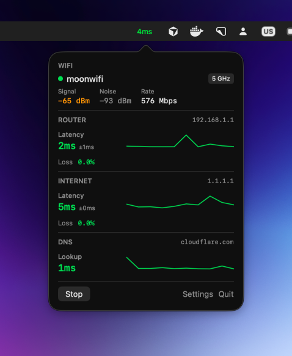

# PingBar

Network diagnostics in your menu bar. Monitor latency, WiFi signal, and connection quality at a glance.

**[Download Latest Release](https://github.com/elitan/ping-bar/releases/latest/download/PingBar.dmg)**

<p align="center">
  
</p>

## Features

- **Menu bar latency** - Live ping displayed in menu bar with color coding
- **WiFi details** - Network name, signal strength, noise floor, link rate, frequency band
- **Router ping** - Latency to gateway with jitter, packet loss, and sparkline history
- **Internet ping** - Latency to 1.1.1.1 with jitter, packet loss, and sparkline history
- **DNS lookup** - Resolution time for cloudflare.com with sparkline history
- **Captive portal detection** - Alerts when network login is required
- **Signed & notarized** - No Gatekeeper warnings

## Install

1. Download [PingBar.dmg](https://github.com/elitan/ping-bar/releases/latest/download/PingBar.dmg)
2. Open the DMG and drag PingBar to Applications
3. Open PingBar

### Build from source

```bash
git clone https://github.com/elitan/ping-bar.git
cd ping-bar
./scripts/build-app.sh
```

## Color Coding

| Metric | Green | Orange | Red |
|--------|-------|--------|-----|
| Latency | <30ms | <100ms | ≥100ms |
| Signal | >-50 dBm | >-70 dBm | ≤-70 dBm |
| Loss | 0% | <5% | ≥5% |

## Requirements

- macOS 13+
- Location permission (optional, for WiFi network name)

## License

MIT
